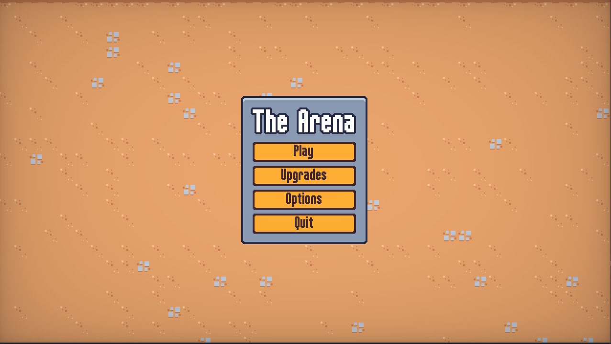
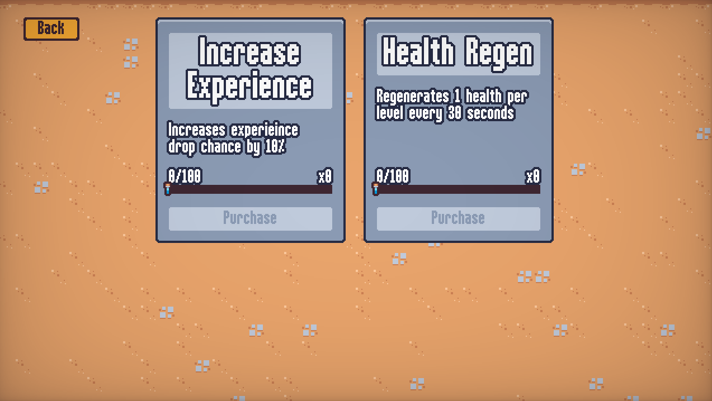

# Survivors Clone

A little survivors clone game created following the excellent course 
[Create a Complete 2D Survivors Style Game in Godot 4](https://www.udemy.com/course/create-a-complete-2d-arena-survival-roguelike-game-in-godot-4/)

# Screenshots and videos

https://github.com/camd67/survivors-clone/assets/7773345/b89be0ef-8735-42c6-bc6e-09ae3264ea2c

https://github.com/camd67/survivors-clone/assets/7773345/df93c791-b48e-4726-a00d-d50b04431e17)https://github.com/camd67/survivors-clone/assets/7773345/df93c791-b48e-4726-a00d-d50b04431e17

https://github.com/camd67/survivors-clone/assets/7773345/72f90bbf-d7f0-4f11-86ee-f60f85117bfa)https://github.com/camd67/survivors-clone/assets/7773345/72f90bbf-d7f0-4f11-86ee-f60f85117bfa

